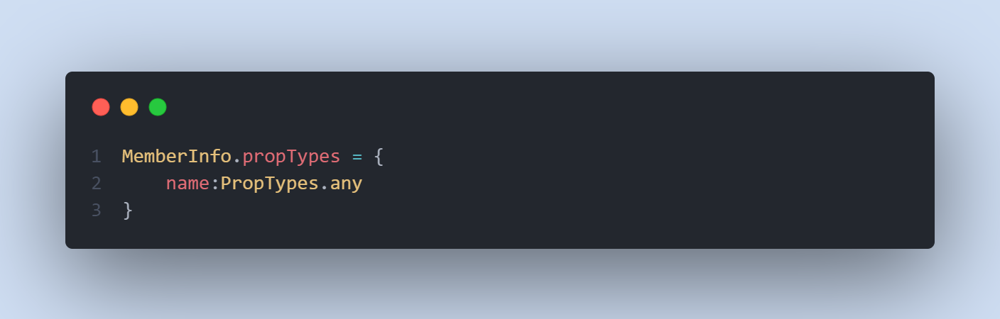

## Writing Test FE Bootcamp Week 2
Nama : Muhammad Arya Wirawan     
Track : Front End Web Development      
Group Track : 2      
Mentor : Thoriq Nur Faizal      

<br>

### Prop Types
#### - Definisi
Prop Types merupakan sebuah library yang dapat membantu kita untuk memeriksa data props yang dikirimkan agar sesuai dengan ekspektasi kita. Jika data props yang dikirimkan tidak sesuai, maka akan muncul pesan error.
#### - Kegunaan
Kegunaan dari penggunaan prop types adalah untuk memastikan data props yang dikirimkan sesuai dengan keinginan kita sehingga meminimalisir adanya bug yang terjadi.
#### - Penggunaan Prop Types
Kita harus menginstall terlebih dahulu prop types pada project kita.
```
npm install prop-types
```
Setelah kita install, kita perlu mengimportnya pada component yang akan menerima props

```
import PropTypes from 'prop-types'
```

Setelah itu, kita dapat menggunakan prop types pada component kita.


Kita ingin menerima data props untuk name berupa string dan untuk age berupa number. maka kita dapat menggunakan proptypes sebagai berikut:

- name akan menampilkan pesan error jika data props yang dikirimkan bukan merupakan tipe data string    
- age akan menampilkan pesan error jika data props yang dikirimkan bukan merupakan tipe data number

Dengan menggunakan proptypes, kita juga dapat mengecek berbagai tipe data lain, seperti:
    - Tipe data bebas
    
    - Tipe data array
    
    - Tipe data boolean 
    
    - Tipe data object
    
Selain itu, kita juga dapat membuat component kita HARUS menerima data props. Caranya dengan menggunakan:


Ketika tidak ada data props yang dikirimkan, maka akan menampilkan pesan error.

Kita juga dapat memberikan opsi pilihan tipe data props yang akan diterima. Caranya dengan menggunakan:

age dapat menerima data props dengan tipe data string ataupun number.

Kita dapat mengecek tipe data yang akan diterima dari data props yang bertipe object dengan cara

### React Router
React Router merupakan library yang dapat membuat kita berpindah-pindah dari suatu halaman ke halaman lainnya.
- Install React Router
Kita dapat ketikkan command berikut di terminal
```
npm install react-router-dom@6
```

Pastikan kita menginstallnya pada project kita.

- Import React Router
Langkah awal menggunakan react router, kita perlu mengimport Browser Router pada file index.js kita
```
import { BrowserRouter } from 'react-router-dom' 
```

Setelah itu, kita dapat menggunakannya pada project kita

- Routes & Route
Routes merupakan pembungkus dari elemen route. Routes dapat memuat banyak route di dalamnya.

Di dalam elemen route, terdapat attribut path dan element.
    - Path merupakan acuan untuk mengarahkan perpindahan halaman / alamat
    - Element digunakan untuk menampilkan halaman yang ingin kita tampilkan sesuai path.
    - Penulisan "/" pada attribute path menandakan bahwa halaman tersebut akan ditampilkan pertama kali / menampilkan halaman utama ketika website dibuka.

Penulisan path harus menggambarkan halaman yang dituju.
- Link
Link merupakan elemen untuk mengarahkan kita dalam berpindah halaman. Link berfungsi mirip seperti element anchor pada HTML. 

Pada element link, terdapat attribut to. attribut tersebut diisi dengan path yang sudah kita buat pada route.
- Params

Params memungkinkan kita untuk mengirimkan data melalui parameter pada event. Params diterima oleh route dengan ":id"
- Use Navigate
  Untuk dapat mengirimkan data, kita dapat menangkap data yang dikirimkan dengan menggunakan Use Navigate
  
Use Navigate menangkap id dari data pada event yang di klik kemudian menjadikan id tersebut menjadi parameter pada route yang sudah dibuat menggunakan params.
- Nested Route
Nested berarti percabangan. Nested router berarti percabangan route. Yang mana suatu route memiliki child route yang mengarahkan ke halaman lainnya. Untuk dapat membuat nested route, kita dapat membuatnya dengan cara berikut:

Nested route memerlukan tag route dengan double tag. tidak seperti route biasa yang hanya memiliki single tag, dalam membuat nested route kita perlu membungkus child dari route kita menggunakan tag Route.
- Outlet
Outlet digunakan untuk mendeteksi child route dari nested route yang telah dibuat. Outlet diimpor pada induk / parent dari nested route yang dibuat
```
<Outlet/>
```
### State Management - React Redux
State Management merupakan cara bagaimana kita memanage state yang ada pada codingan kita agar efektif dan efisien. State management terdiri dari berbagai cara, yaitu redux, context, jotai dan lain-lain. Yang umum digunakan yaitu redux dan context.   
Konsep dari state management adalah membuat state global untuk memenuhi kebutuhan dari komponen-komponen yang ada sehingga tidak perlu melakukan props drilling yang dalam.

- React Redux
  React redux merupakan library yang dapat memudahkan kita untuk melakukan state management pada project kita.
    - Install redux
      Untuk dapat menggunakan redux pada project kita, kita perlu menginstallnya terlebih dahulu
    ```
    npm install redux
    ```
    ```
    npm install react-redux
    ```
- Tahapan pembuatan redux pada project
     1. Menyediakan tempat untuk menyimpan data (store)
      Store merupakan tempat kita untuk menyimpan state / data yang diperlukan oleh banyak komponen. 
      Kita dapat membuat store dengan cara:
      
      Store menerima suatu fungsi yang disebut dengan reducer
    2. Membuat reducer
      Reducer diibaratkan seperti rak barang yang ada di dalam gudang (store). Reducer merupakan sebuah function.
       
      Setelah kita buat reducer, kita panggil reducer ke dalam store
      
    3. Membuat provider
      Setelah itu, kita memberi tahu component bahwa store tersedia untuk component yang membutuhkan data dari store. Kita import provider pada file utama kita (index.js) dan bungkus App dengan provider
      
    4. Ambil data dari store
      Untuk mengambil data dari store, kita dapat menggunakan useSelector
      
    5. Action
      Action merupakan function yang mereturn object. 
      
    6. Dispatch
      Untuk memanggil action pada event yang kita buat, kita dapat menggunakan useDispatch
      
      useDispatch menerima action yang telah kita buat
      


### Thunk
Thunk merupakan middleware yang memungkinkan kita membuat action / function yang bersifat asynchronous. Digunakan ketika kita mengambil data dari API. Thunk dapat menghandle action yang bersifat asynchronous (callback, promoise, async await dll)
- Install
  ```
  npm install thunk
  ```
Setelah itu, kita pasang pada store ynag sudah kita buat


Setelah itu, kita dapat membuat reducer dengan asynchronous seperti biasa.